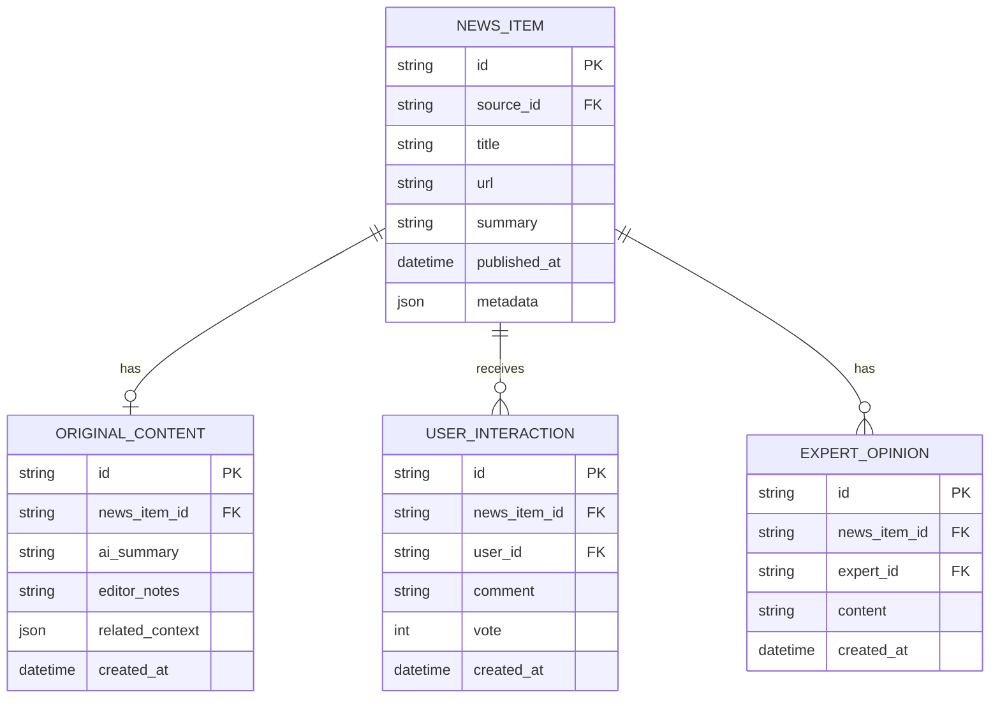

# Google AdSense 合规改造方案

## 问题背景

Google AdSense政策明确规定不允许在以下情况展示广告：
1. 在不包含发布商内容的屏幕上展示广告
2. 在低价值内容页面上展示广告

这些规定对NewsNow项目提出了挑战，因为作为新闻聚合平台，我们需要确保在展示外部新闻内容的同时，提供足够的原创价值。

## 改造方案

### 1. 增加原创内容

#### 加载页面和空状态页面
- **问题**: 加载状态和空结果页面通常没有实质内容
- **解决方案**: 
  - 在加载页面添加有用的提示信息、热门话题推荐
  - 在空结果页面提供相关推荐和热门内容
  - 在这些页面上不展示广告，直到内容加载完成

#### 实现代码示例
```tsx
function LoadingState() {
  return (
    <div className="loading-container">
      <LoadingIndicator />
      <div className="loading-content">
        <h3>正在为您加载最新新闻</h3>
        <div className="tips-section">
          <h4>今日热门话题</h4>
          <ul>
            {hotTopics.map(topic => (
              <li key={topic.id}>{topic.title}</li>
            ))}
          </ul>
        </div>
        {/* 不在加载状态显示广告 */}
      </div>
    </div>
  );
}
```

### 2. 提升内容价值

#### 新闻摘要页面
- **问题**: 仅显示外部新闻标题和简短描述可能被视为低价值内容
- **解决方案**:
  - 为每个新闻条目添加AI生成的摘要或分析
  - 添加编辑推荐和相关背景信息
  - 增加用户互动元素（评论、投票）
  - 添加分类标签和相关新闻推荐

#### 实现代码示例
```tsx
function EnhancedNewsItem({ item }) {
  return (
    <div className="news-item enhanced">
      <h3>{item.title}</h3>
      <div className="source-info">
        <SourceBadge source={item.source} />
        <TimeAgo date={item.publishedAt} />
      </div>
      
      {/* 原创价值增强部分 */}
      <div className="original-content">
        <div className="ai-summary">
          <h4>快速摘要</h4>
          <p>{item.aiSummary}</p>
        </div>
        
        <div className="editor-notes">
          <h4>编辑笔记</h4>
          <p>{item.editorNotes}</p>
        </div>
        
        <div className="related-context">
          <h4>相关背景</h4>
          <ul>
            {item.relatedContext.map(context => (
              <li key={context.id}>{context.title}</li>
            ))}
          </ul>
        </div>
      </div>
      
      {/* 用户互动部分 */}
      <div className="user-interaction">
        <VoteButtons itemId={item.id} />
        <CommentSection itemId={item.id} />
      </div>
      
      {/* 此处可以安全地放置广告 */}
      <GoogleAd slot="in-feed" />
    </div>
  );
}
```

### 3. 内容页面改造

#### 详情页面
- **问题**: 直接展示外部新闻全文可能侵犯版权，且被视为复制内容
- **解决方案**:
  - 实现原创评论和分析系统
  - 添加多源对比功能，展示不同来源对同一事件的报道
  - 提供深度背景资料和时间线
  - 添加专家观点和社区讨论

#### 实现代码示例
```tsx
function NewsDetailPage({ newsId }) {
  return (
    <div className="news-detail-page">
      <HeaderAd slot="detail-header" /> {/* 顶部广告 */}
      
      <div className="original-analysis">
        <h2>编辑分析</h2>
        <div className="author-info">
          <Avatar src={editor.avatar} />
          <span>{editor.name}</span>
          <TimeAgo date={analysis.publishedAt} />
        </div>
        <div className="analysis-content">
          {analysis.content}
        </div>
      </div>
      
      <div className="multi-source-comparison">
        <h2>多源报道对比</h2>
        <SourceComparisonTable sources={relatedSources} />
      </div>
      
      <div className="timeline">
        <h2>事件时间线</h2>
        <EventTimeline events={timelineEvents} />
      </div>
      
      <div className="expert-opinions">
        <h2>专家观点</h2>
        {expertOpinions.map(opinion => (
          <ExpertOpinionCard key={opinion.id} opinion={opinion} />
        ))}
      </div>
      
      <GoogleAd slot="mid-content" /> {/* 中部广告 */}
      
      <div className="community-discussion">
        <h2>社区讨论</h2>
        <DiscussionThread threadId={newsId} />
      </div>
      
      <div className="related-news">
        <h2>相关新闻</h2>
        <RelatedNewsList items={relatedNews} />
      </div>
      
      <GoogleAd slot="bottom-content" /> {/* 底部广告 */}
    </div>
  );
}
```

### 4. 数据库模型扩展

为支持上述改造，需要扩展数据库模型：



## 广告展示策略

### 1. 内容优先原则

- 确保页面首先加载内容，然后才加载广告
- 使用内容/广告比例检查，确保每个页面的广告不超过内容的30%
- 实现广告可见性检测，只在内容充分展示后才显示广告

### 2. 条件性广告展示

```tsx
function useContentMetrics() {
  const [contentLoaded, setContentLoaded] = useState(false);
  const [contentLength, setContentLength] = useState(0);
  const [adVisibility, setAdVisibility] = useState(false);

  // 检测内容是否充分
  useEffect(() => {
    const contentElement = document.querySelector('.content-container');
    if (contentElement) {
      const observer = new IntersectionObserver((entries) => {
        const ratio = entries[0].intersectionRatio;
        setAdVisibility(ratio > 0.5);
      }, {threshold: 0.5});
      
      observer.observe(contentElement);
      setContentLength(contentElement.textContent?.length || 0);
      setContentLoaded(true);
      
      return () => observer.disconnect();
    }
  }, []);

  return { contentLoaded, contentLength, adVisibility };
}

function ConditionalAdDisplay({ children, slot }) {
  const { contentLoaded, contentLength, adVisibility } = useContentMetrics();
  const [showAd, setShowAd] = useState(false);
  
  // 满足条件后延迟500ms展示广告
  useEffect(() => {
    if (contentLoaded && contentLength > MIN_CONTENT_LENGTH && adVisibility) {
      const timer = setTimeout(() => setShowAd(true), 500);
      return () => clearTimeout(timer);
    }
  }, [contentLoaded, contentLength, adVisibility]);
  
  return (
    <>
      {children}
      {showAd && (
        <div className="ad-container" data-slot={slot}>
          <GoogleAd slot={slot} />
          <AdPerformanceMonitor slot={slot} />
        </div>
      )}
    </>
  );
}
```

### 3. 广告性能监控

```tsx
function AdPerformanceMonitor({ slot }) {
  useEffect(() => {
    const observer = new PerformanceObserver((list) => {
      list.getEntries().forEach(entry => {
        if (entry.name.includes(slot)) {
          logAdPerformance({
            slot,
            loadTime: entry.loadTime,
            renderTime: entry.renderTime,
            visibleDuration: entry.visibleDuration
          });
        }
      });
    });
    
    observer.observe({ type: 'ad', buffered: true });
    return () => observer.disconnect();
  }, [slot]);
  
  return null;
}
```

### 4. 页面类型分类与广告策略

| 页面类型 | 内容增强方式 | 广告策略 |
|---------|------------|---------|
| 首页列表 | 添加编辑推荐、AI摘要、用户互动 | 每8-10条新闻后展示1条广告 |
| 分类页面 | 添加分类介绍、热门话题、专家推荐 | 页面顶部和底部展示广告 |
| 详情页面 | 添加原创分析、多源对比、专家观点 | 内容中和底部展示广告 |
| 搜索结果 | 添加搜索分析、相关推荐 | 仅在结果数>5时展示广告 |
| 用户页面 | 完全原创内容 | 可以自由展示广告 |

## 实施路线图

### 阶段一：基础合规（1-2周）
#### 具体任务
- [ ] 修改加载状态页面（1天）
  - 添加热门话题推荐组件
  - 实现无广告加载逻辑
- [ ] 空状态页面改造（2天）
  - 设计相关内容推荐
  - 集成无广告展示机制
- [ ] 条件性广告展示系统（3天）
  - 开发`useContentMetrics`钩子
  - 实现广告延迟加载
  - 集成可见性检测
- [ ] 隐私政策更新（1天）
  - 审核现有政策
  - 添加广告相关条款

#### 技术依赖
- React Intersection Observer API
- Google AdSense SDK
- 内容分析工具库

#### 风险评估
| 风险 | 可能性 | 影响 | 缓解措施 |
|------|--------|------|----------|
| 广告延迟影响收益 | 中 | 中 | 设置合理的延迟阈值 |
| 内容检测不准确 | 低 | 高 | 多维度检测机制 |
| 政策更新不及时 | 中 | 高 | 设置定期审核机制 |

### 阶段二：内容增强（2-4周）
#### 具体任务
- [ ] AI摘要生成系统（5天）
  - 集成NLP服务API
  - 开发摘要缓存机制
  - 实现质量评估模块
- [ ] 编辑笔记功能（3天）
  - 搭建后台编辑系统
  - 开发富文本编辑器
  - 实现审核工作流
- [ ] 用户互动元素（4天）
  - 评论系统开发
  - 投票功能实现
  - 反垃圾系统集成

#### 技术依赖
- 自然语言处理API（如OpenAI）
- 富文本编辑器库（如Tiptap）
- 实时数据库（如Firebase）

#### 风险评估
| 风险 | 可能性 | 影响 | 缓解措施 |
|------|--------|------|----------|
| AI生成内容质量不稳定 | 高 | 高 | 设置人工审核流程 |
| 用户互动功能滥用 | 中 | 中 | 实现严格的内容审核 |
| 系统性能下降 | 低 | 高 | 优化缓存策略 |

### 阶段三：深度整合（4-6周）
#### 具体任务
- [ ] 多源对比功能（7天）
  - 开发新闻相似度算法
  - 实现对比界面
  - 优化性能
- [ ] 专家观点系统（5天）
  - 专家认证流程
  - 内容发布系统
  - 质量控制系统
- [ ] 事件时间线（3天）
  - 时间线可视化
  - 自动事件提取
  - 手动编辑功能

#### 技术依赖
- 事件提取NLP模型
- 时间线可视化库（如Vis.js）
- 专家认证服务

#### 风险评估
| 风险 | 可能性 | 影响 | 缓解措施 |
|------|--------|------|----------|
| 多源对比准确性不足 | 中 | 中 | 结合人工校验 |
| 专家内容产出不足 | 高 | 中 | 建立激励机制 |
| 时间线信息过载 | 低 | 低 | 实现智能折叠 |

### 阶段四：优化与监测（持续）
#### 具体任务
- [ ] A/B测试框架（持续）
  - 广告位测试
  - 内容布局优化
- [ ] 广告效果监控（持续）
  - 展示率跟踪
  - 点击率分析
  - 收益报表
- [ ] 策略调整机制（持续）
  - 自动警报系统
  - 季度政策审查

#### 技术依赖
- A/B测试平台（如Optimizely）
- 数据分析工具（如Google Analytics）
- 自动化警报系统
